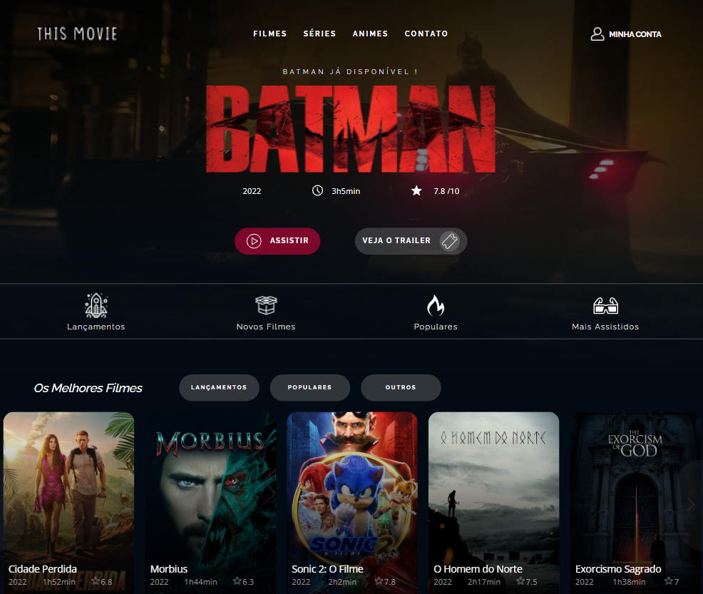
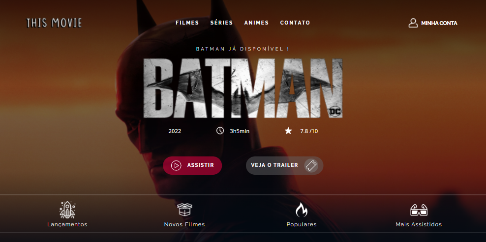
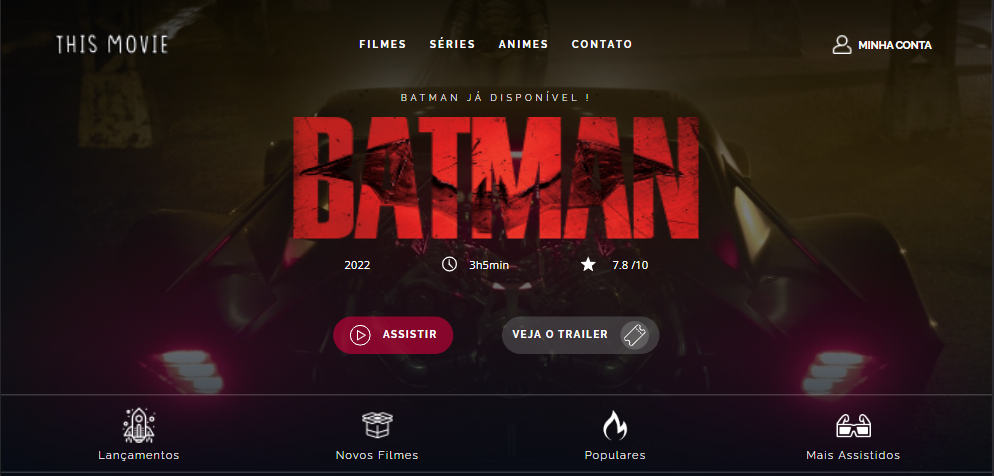
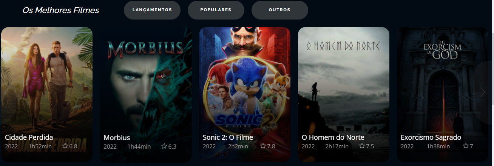
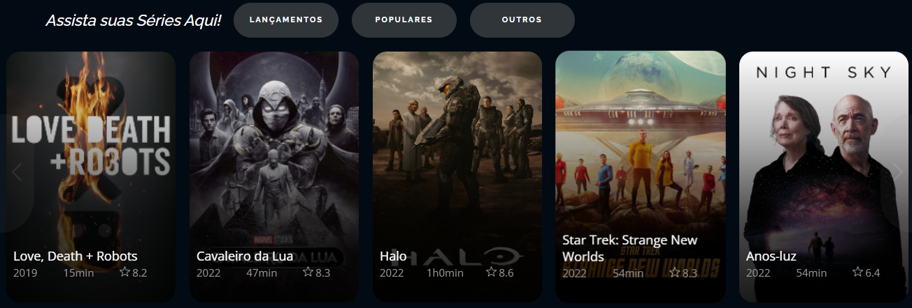

  
  <h1 align="center">THIS MOVIE</h1>

## 📸: Um resumo sobre o que se trata

Movie é um projeto de estudo voltado a Front End, com a finalidade de demonstrar a habiidade desse que vos fala de consumir uma API gratuita disponível na web, o TMDB. 
Um site de entretenimento e consumo de produto áudio / visual, tal qual alguns serviços de streaming que temos no mercado.

Abaixo, farei a descrição de como foi o processo e pensamento para desenvolvimento do mesmo.

 <strong>Me segue aqui nas redes sociais para acompanhar mais conteúdo! </strong>  

## ©️ Direitos autorais

> Esse projeto sem fins lucrativos tomou como ferramenta a API do TMDB, hoje uma rerefência de projeto gratuito que está disponível abaixo: 
- [TMDB](https://www.themoviedb.org) - Site TMDB aonde você encontrará uma API completa e gratuita para seus estudos e aplicações.

## 🖥️: Sobre as tecnologias 

Movie foi pensado para utilizar as tecs iniciais do Front End, logo todo o projeto foi pensando para utilizar HTML5, CSS3 e Javascript ES6.
Isso tornou o projeto um tanto desafiador, pois o objetivo também era deixar o site com um visual moderno, com UI/UX bem desenvolvidos.

## 🎨: MOVIE 

## 🎨: DESTAQUE

O destaque do Movie foi pensado para surpreender, a intenção é sugerir um filme ou série randômica, porém, sem necessariamente avisar ao usuário que isto ocorre.

De que forma? 

No loading da página, o JS faz um sorteio baseado na Lista de Recomendados do TMDB. Então com a informação do filme/série sorteado, executamos outra requisição
em busca das informações de imagem (Logo e Background) e outras informações como:

Duração / Data de estréia / Avaliação

Vale destacar que a respeito das imagens, também são sorteadas baseadas nas listas disponíveis para aquele filme em questão. Logo, sempre teremos
uma combinação diferente entre Logo e Background, isso me garantindo uma variedade de apresentações e tornando a experiência mais interessante. 

Como por exemplo, o filme utilizado acima.

O Cavaleiro das Trevas precisa de um convite que faça sentido HAHA 🦇

DESTAQUE 01

DESTAQUE 02

## 🎨: CONTEÚDO / MAIN

Duas seções de carrosel podem ser percebidas no mapeamento do site. Essas que por sua vez são independentes uma da outra e ambas consomem uma lista específica 
para cada uma. 

- A primeira, seleciona e faz a busca da lista dos filmes mais interessantes do momento com base na opinião crítica do público.

- A segunda, por sua vez, faz a busca da lista de séries mais interessantes.

## 🎨: RODAPÉ / FOOTER

## 🌎 GITHUB PAGES

Sim!!! O Movie pode ser visitado através do Github Pages

Só clicar e conferir!

